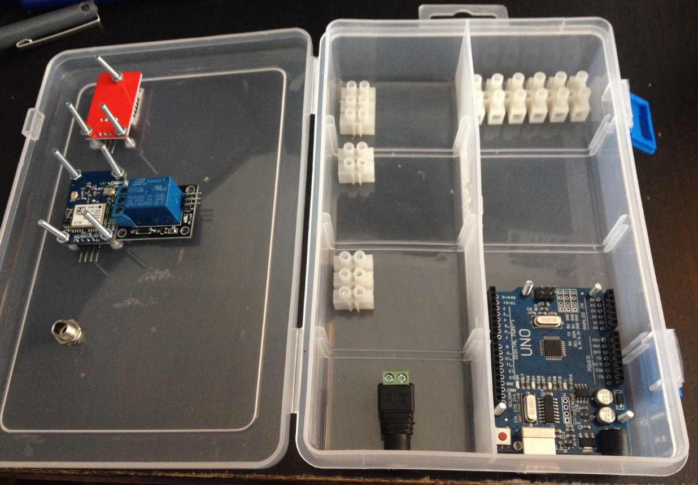

<h2 align="center">:warning: This repository is not longer maintained :warning:</h2>


# Agroduino
Una estación meteorológica con Arduino, Node.js y Firebase


### Datos en formato JSON

```json
{
    "errores": false,
    "humedadTierra": {
        "valido": true,
        "valor": 1023,
        "umbral": false
    },
    "flujo": {
        "valido": true,
        "valor": 0,
        "unidad": "Litros/Hora"
    },
    "bomba": {
        "valido": true,
        "funcionando": true
    },
    "lluvia": {
        "valido": true,
        "descripcion": "Seco",
        "lloviendo": 0
    },
    "humedad": {
        "valido": true,
        "valor": 43,
        "unidad": "%"
    },
    "temperatura": {
        "valido": true,
        "valor": 23,
        "unidad": "C"
    },
    "gps": {
        "valido": true,
        "latitud": 40.418889,
        "longitud": -3.691944,
        "rumbo": 45,
        "altitud": 1308,
        "satelites": 4,
        "fecha": {
            "dia": "DDMMYY",
            "hora": "HHMMSSCC"
        },
        "velocidad": {
            "mps": 100,
            "kmh": 1
        }
    }
}
```

### [Demo](http://ulisesgascon.github.io/Agroduino)


### Montaje


### Detalle sensores


### Iluminación


